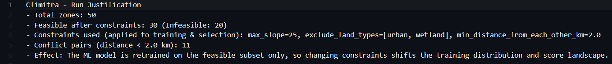
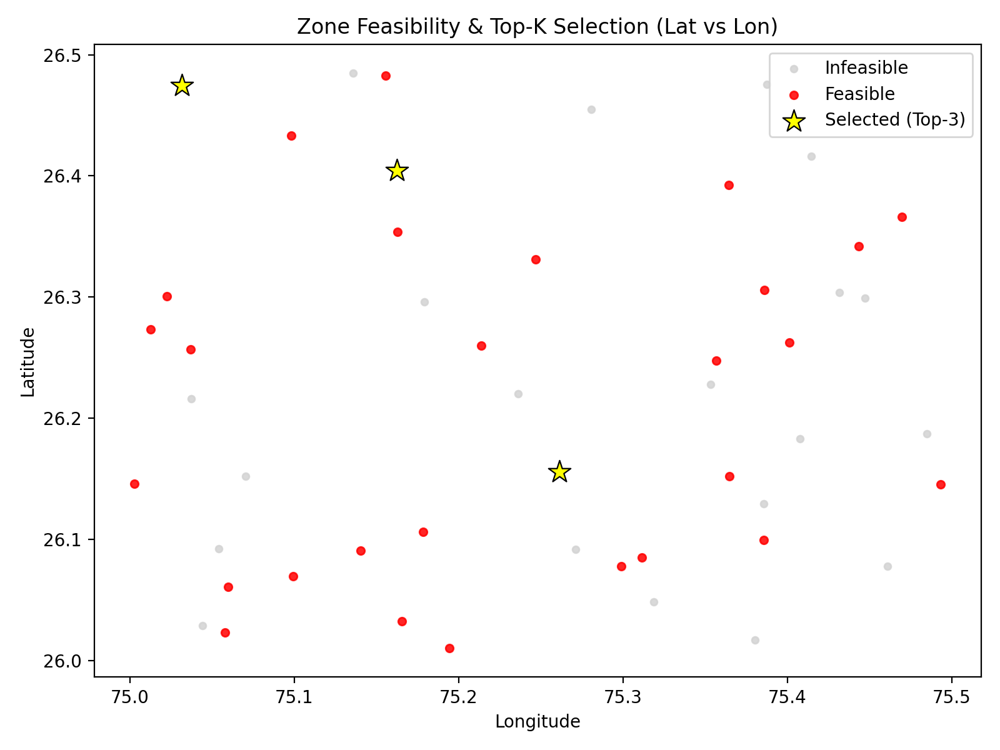

# Optimal Placement of Resource Collection Centers – ML + MILP Candidate Zone Ranker

**Assignment for Climitra – AI/ML Engineer Intern Position**  
**Case Title:** *Optimal Placement of Resource Collection Centers*  

**Author:** Ananya Anandharaman  
Integrated M.Tech. in Applied Geophysics, IIT (ISM) Dhanbad  
Roll No: 21JE0105

---

## About the Project

This project is my approach to solving Climitra’s "Optimal Placement of Resource Collection Centers" challenge.

It uses a **hybrid ML + MILP pipeline** to:
1. Score candidate zones using a constraint-aware ML model.
2. Select the **Top-K** zones via MILP optimization. (k being variable)

The aim is to balance **real-world feasibility** (terrain, land type, spacing) with an adaptable scoring model that can improve as better data becomes available.

---

## How It Works

### **Inputs**
The following files were provided to us to work with
- `zone_features.csv` – columns: `id, slope, elevation, land_type`
- `road_network.csv` – distance matrix between points `p1..pN` 
- `constraints.json` – config file:
    ```json
    {
      "exclude_land_types": ["wetland"],
      "max_slope": 25,
      "min_distance_from_each_other_km": 2
    }
    ```

### **Key Assumption**
This model assumes that the facilities are to be opened at the nodes itself (at the points provided) and not in between nodes. 

### **Steps**
1. **ML Step (Constraint-aware training)**  
   - the model trains only on zones that already pass the constraints.  
   - changing `constraints.json` changes the training set and resulting scoring.  
   - it starts with heuristic priors (no labels), but can use business KPIs if available (for future improvements)

2. **MILP Step (For selection of top zones)**  
   - selects "K" feasible zones with:
     - terrain and land-type restrictions
     - pairwise spacing enforced
     - minimum total predicted score

---

## Installation
First, create a new environment in conda (or a virtual environment using python). Then install required packages:
```bash
pip install -r requirements.txt
```

---

## Basic Run
```bash
python -m climitra.run \
  --zones data/zone_features.csv \
  --roads data/road_network.csv \
  --constraints data/constraints.json \
  --k 3
```

And to edit constraints through command line:
```bash
python -m climitra.run \
  --zones zone_features.csv \
  --roads road_network.csv \
  --constraints constraints.json \
  --k 3 \
  --max_slope 22 \
  --exclude_land_types wetland,barren \
  --min_distance_km 3
```

---

## Outputs
Three output files are saved on each run:
1. ranking.csv - all feasible zones with score and rank
2. top_k.json - selected Top-k zones with details
3. justification.txt - a simplified explanation of the run and how changing constraints affected results

4. selection_plot.png - a simple scatter plot showing feasible, infeasible and selected top-K points


---

## What can you try?
You can edit the constraints (either directly in the json file or via command line). Either increase or decrease maximum slope  limit, exclude or include different land types or change minimum spacing between two centres. 

---

## Suggested improvements
Afew things that can be done to improve this project:
1. try different ML algorithms for richer feature engineering 
2. add an interactive dashboard with sliders/buttons to better visualise how changing constraints affect collection centers
3. integrate geospatial APIs for better visualisation (like fun fact, this dataset is in Rajasthan!)
